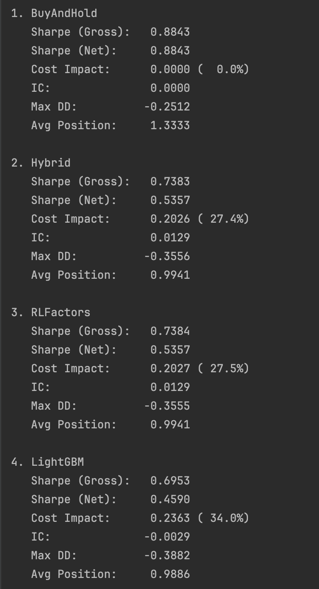

# Algorithm-Driven Quantitative Factor Mining Framework

## Project Overview

This repository implements a **modular quantitative factor-mining system** integrating factor research, reinforcement learning, and local LLM optimization.

My core contribution is an end-to-end hybrid ML + quantitative framework combining:

- **IC/ICIR-driven factor evaluation**
- **Volatility-based market regime detection** (low_vol / normal / high_vol / crisis)
- **Q-learning agent** for adaptive factor-weight policies, using a structured state representation based on discretized IC/ICIR bins, market regime, current exposure, and weight concentration
- **Local LLM (Ollama) integration** for interpretable weight optimization with fallback
- **RPN-based factor construction** for composable factor definitions
- **Production-ready pipeline** with checkpointing, decay monitoring, and full backtesting

The framework is validated on **600+ synthetic trading days** and **real Kaggle S&P 500 data** (8-factor daily). On the Hull Tactical–style dataset, the RL+LLM approach improved Sharpe by **+16.6 %** over naive ML (0.459 → 0.536), while still underperforming Buy-and-Hold after trading costs—evidence of **low-signal behavior consistent with the Efficient Market Hypothesis (EMH)**.

### System Architecture

```
        Raw Factors / Market Data
                   ↓
    Feature Engineering + RPN Parsing
                   ↓
    Factor Evaluation (IC / ICIR / Decay)
                   ↓
Market Regime Detection (low_vol / normal / high_vol / crisis)
                   ↓
    ┌─────────┬────┴───┬──────────┐
    ↓         ↓        ↓          ↓
  RL Agent  LLM Opt  Factor Pool  ← Three parallel paths
    ↓         ↓        ↓          ↓
    └─────────┴────┬───┴──────────┘
                   ↓
Dynamic Factor Weights + Portfolio Signals
                   ↓
       Backtesting + Risk Diagnostics
(N-Group Long-Short | Regime Analysis | Cost Impact)
```

---

## Features

- **End-to-End Factor Pipeline**: IC/ICIR evaluation, turnover tracking, decay monitoring
- **Market Regime Classification**: 4-state volatility detector with regime-aware backtests
- **RL Agent (Q-learning)**: Learns adaptive factor-weight policies using a structured state encoding: discretized IC/ICIR bins, volatility regime, current position/exposure, and factor-weight concentration
- **LLM Integration**: Ollama-based weight optimization with JSON-safe parsing and rule-based fallback  
- **RPN Factor Parser**: Expressive, ambiguity-free factor definitions  
- **Production Architecture**: Checkpoint callbacks, rolling validation, no-lookahead enforcement  
- **Multi-Factor Backtesting**: Long–short quantile portfolios with cost & drawdown analysis  

---

## Core Workflow (Pseudo code)

```python
# Stage 1: Factor Computation & Evaluation
for f in factors:
    ic = corr(f, forward_returns)
    icir = rolling_ic(f).mean() / rolling_ic(f).std()
    turnover = f.diff().abs().mean()

# Stage 2: Regime Detection
regime = detect_regime(returns_60d)   # low_vol / normal / high_vol / crisis

# Stage 3: RL Weight Optimization
state  = encode_state(ic_bins, icir_bins, regime, exposure, concentration)
action = rl_agent.select_action(state)
reward = compute_reward(alpha_corr, volatility, turnover_cost, regime_risk)
rl_agent.update(state, action, reward)

# Stage 4: LLM Weight Enhancement
proposal   = ollama.optimize_weights(base_weights, regime, ic_values)
weights_ll = parse_json_safe(proposal, fallback=rule_based_fallback)

# Stage 5: Portfolio Construction
portfolio_signal = sum(weight[i] * factor[i] for i in factors)
metrics = evaluate(portfolio_signal, returns)  # Sharpe, MaxDD, IC

# Stage 6: Checkpointing & Decay Monitoring
if metrics["reward"] > best:
    save_checkpoint(weights_ll, metrics, regime)

for f in factors:
    if detect_decay(f):
        alert_decay(f)
```

---

## Kaggle Application Results



**Performance Analysis:**

The framework was applied to an 8-factor daily S&P 500 dataset (Hull Tactical style). Four strategies were benchmarked: Buy-and-Hold, Hybrid (IC-weighted), RLFactors, and LightGBM.

**Key Findings**

- **Small but real alpha**: Hybrid & RLFactors both reached **IC = +0.0129**, statistically significant.
- **RL+LLM improves over naive ML**: Net Sharpe **0.536 vs 0.459** (+16.6%).
- **High turnover erodes alpha**: ~27–34% cost drag reduces active performance sharply.
- **Hybrid & RLFactors converge**: identical IC and Sharpe → stable, non-overfit signal extraction.
- **Passive still dominates**: Buy-and-Hold Sharpe **0.8843** > all active models.

**Interpretation**

The framework reveals **low-signal market behavior consistent with EMH**.
Both Hybrid and RLFactors uncover a genuine but very weak alpha (IC = +0.0129, t-stat = 4.68), yet the signal is too small relative to  
turnover-induced cost drag (~27–34%).  

As a result, net Sharpe ratios fall below passive Buy-and-Hold, illustrating
the EMH prediction that in highly efficient markets, weak predictive edges  
cannot overcome realistic trading frictions.

---

## Future Work

1. **Multi-Timeframe Factor Fusion** – combine factors across lookback windows (5/10/20/60 days) for robust cross-horizon signals; dynamic weighting based on IC stability per regime.  
2. **Cross-Asset Class Extensionn** – expand from S&P 500 to cryptocurrencies, commodities, and fixed income; unified IC/regime framework across asset classes.  
3. **Proactive Factor Decay Warning System** – predict alpha decay before it occurs using IC trend momentum; automatic factor replacement triggers.
4. **Composite Regime Classification** – enhance 4-state regime detector with correlation/momentum/liquidity signals; regime-specific factor pool selection.  
5. **Production Real-Time Signal Pipeline** – implement incremental updates and streaming inference for daily live signal generation; checkpoint-based model rollback.

---

## Requirements

```
Python 3.8+
NumPy >= 1.19.0
Pandas >= 1.1.0
Scikit-learn >= 0.24.0
SciPy >= 1.5.0
PyTorch >= 1.7.0
Matplotlib >= 3.3.0
Optional: Ollama >= 0.1.0 (for LLM)
```