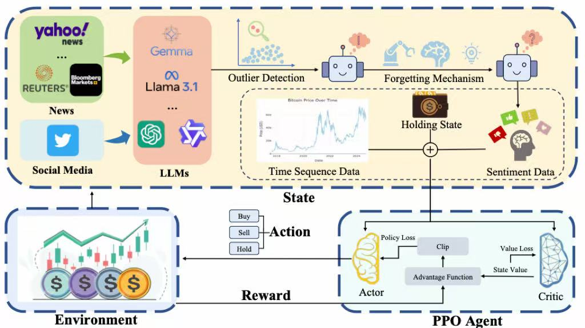
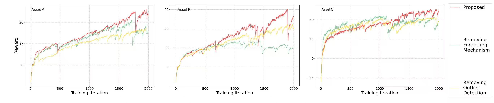
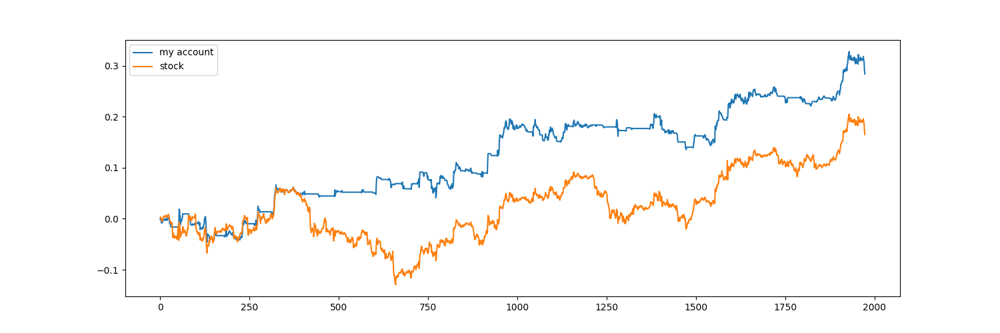
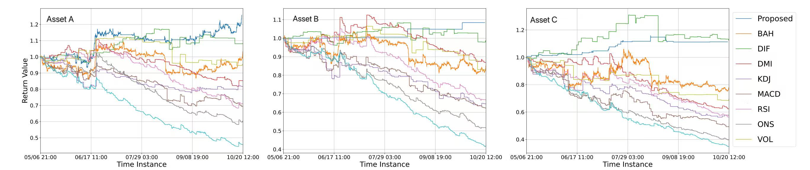

## Project Overview
This repository presents the **reinforcement learning framework I designed and implemented** for a real-time market-simulation trading system.

While an upstream research team provided **optional external sentiment features**, **all reinforcement-learning, modelling, and system-level components were implemented by me**.

My work focuses entirely on the **downstream quantitative trading module**, including:

- A PPO-based trading agent with an LSTM policy network for sequence-aware decision-making
- A sliding-window state representation constructed from price, volume, and technical indicators (EMA, MACD, RSI, KDJ, etc.)
- Optional external sentiment features (provided by the LLM team; not implemented here)
- Optional integration of external sentiment features (consumed as inputs; not implemented in this repository)
- A risk-sensitive reward function combining realised returns with volatility penalisation
- A full training pipeline: on-policy data collection, experience buffer, PPO updates, and convergence monitoring
- A custom execution-aware backtesting engine supporting transaction costs, position tracking, and PnL evaluation
- Visualisation tools for analysing agent behaviour, trading actions, and out-of-sample performance

This repository **does not include the sentiment-feature generation module**, which was developed independently and imported as external data. The code here focuses exclusively on reinforcement learning, environment design, and trading-strategy evaluation.

This implementation corresponds to the reinforcement learning module described in our paper:  
*Enhancing Cryptocurrency Trading Strategies: A Deep Reinforcement Learning Approach Integrating Multi-Source LLM Sentiment Analysis (IEEE CIFEr 2025).*  
[[PDF]](../../publications/Enhancing_Cryptocurrency_Trading_Strategies_A_Deep_Reinforcement_Learning_Approach_Integrating_Multi-Source_LLM_Sentiment_Analysis.pdf)



---

## Features

- PPO with LSTM-based policy networks for sequence-aware decision-making using price-, volume-, and indicator-derived features
- Sliding-window technical feature extraction, including EMA, MACD, RSI, KDJ, CCI, ADX, and volatility measures
- Custom execution-aware trading environment with position tracking, transaction costs, and PnL evaluation
- Risk-sensitive reward function combining realised returns with volatility penalisation to encourage stable behaviour
- Comprehensive visualisation tools for analysing agent actions, rewards, PnL curves, and training convergence
- Efficient PyTorch implementation, supporting both CPU and GPU training
- Robust backtesting module for out-of-sample evaluation under multiple market scenarios

---

## Core Workflow (Pseudo code)

The following pseudo-code summarizes the core **PPO-LSTM training pipeline** implemented in this project.
It highlights how the agent interacts with the execution-aware trading environment, collects on-policy trajectories, computes advantages using **Generalized Advantage Estimation (GAE)**, and performs clipped PPO optimisation.

```python
# PPO-LSTM Training Loop (Simplified Pseudo-code) 
initialize PPO(agent = LSTM(policy_input_features))

for episode in range(max_episodes):
    s = env.reset()
    h = agent.init_hidden()  # initialize hidden state
    done = False

    while not done:
        # 1. Forward pass through policy network
        prob, h_next = agent.policy(s, h)
        a = sample_action(prob)
        s_next, r, done = env.step(a)

        # 2. Store experience (on-policy)
        agent.put_data((s, a, r, s_next, prob[a]))
        s, h = s_next, h_next

    # 3) PPO update (multiple epochs per episode)
    for epoch in range(K):
        v_s      = agent.value(s)
        v_s_next = agent.value(s_next)

        # GAE advantage estimation
        advantage = compute_GAE(rewards=r, values=v_s, next_values=v_s_next)

        # ratio = πθ(a|s) / πθ_old(a|s)   (old prob from buffer)
        ratio        = new_policy_prob / old_policy_prob
        clipped_term = clip(ratio, 1 - ε, 1 + ε) * advantage
        policy_loss  = -min(ratio * advantage, clipped_term)
        value_loss_  = value_loss(v_s, r + γ * v_s_next)

        optimize(policy_loss + value_loss_)
```  
**Risk-adjusted reward design:**  
`R_t = ROI_t − λ × VolatilityPenalty_t`

The reward penalises volatility and unnecessary trading activity, encouraging the agent to learn **stable, risk-aware behaviour** rather than chasing short-term fluctuations.

---

## Module Justification

### `RL_brain.py` — PPO Agent

This module implements the **PPO agent with an LSTM-enhanced actor–critic architecture**.
It defines the policy network, value network, and the entire optimisation pipeline.

- Model Architecture:
    - Combines a feedforward feature extractor with an `LSTM layer` for temporal modelling.
    - `pi()` outputs the probability distribution (policy network).
    - `v()` estimates the state value (value network).
- Core Training Logic `train_net()`:
    - Computes `Generalized Advantage Estimation (GAE)` for variance-reduced advantage calculation.
    - Implements `PPO-Clip` to stabilise policy updates.
    - Optimises actor and critic jointly using the combined loss.
- On-Policy Experience Buffer
    - `put_data()` collects (`state, action, reward, prob`) tuples.
    - `make_batch()` constructs mini-batches for PPO updates.
    - Buffer is cleared each episode to maintain correct on-policy learning.

### `stock_env.py` — Trading Environment

This module implements a **time-series trading environment** driven by sliding-window technical features.
It serves as the interface between the agent and the market simulation logic.

- State Representation:
    - Each state consists of a `24-step sliding window` of price, volume, and technical indicators (EMA, MACD, RSI, KDJ, CCI, ADX, volatility measures).
    - Includes a position flag to encode the current exposure.
    - Provides a structured sequence input for the LSTM policy.
- Action Space:
    - 3 discrete actions: `Buy`, `Sell`, `Hold`.
    - Updates portfolio position based on selected action.
- Risk-Adjusted Reward:
    - Reward reflects realised PnL, transaction costs, and a volatility penalty.
    - Encourages `stable, risk-aware behaviour` rather than aggressive position-taking.
- Backtesting Visualisation:
    `draw()` plots: `price series`, `positions`, `cumulative PnL`, `agent decisions`

### `run_this(ppo).py` — Execution Script

This script integrates the PPO agent, environment, training loop, and backtesting routine.

Core functions:
- Data Preprocessing:
    - Applies `StandardScaler` for feature normalisation.
    - Constructs training/testing splits for sequential evaluation.
- PPO Training Loop:
    - Interacts with the environment to collect on-policy trajectories.
    - Calls `put_data()` to store `(state, action, reward, prob)` tuples.
    - Performs PPO updates every episode using freshly collected data.
- Backtesting & Evaluation
    - Periodically evaluates the policy on held-out test data.
    - Uses `BackTest()` with a greedy policy (`argmax(prob)`).
    - Generates plots for: `PnL curves`, `action sequences`, `reward trends`

---

## Example Output

Below are representative visualisations from the training and evaluation pipeline:
- Reward trajectory during training
    
- Cumulative portfolio value vs benchmark reference
    
- Out-of-sample evaluation under multiple test scenarios
    

---

## Future Work

1. **Algorithmic Enhancements** – extend the framework to support alternative RL algorithms (e.g., PPO with entropy annealing, SAC, or Transformer-based policies) and enable more robust hyperparameter tuning.
2. **Feature Engineering** – incorporate additional time-series features such as volatility estimators, liquidity proxies, and microstructure-inspired indicators to strengthen state representation.
3. **Execution & Risk Modelling** – enrich the environment with more realistic transaction-cost models, slippage assumptions, position-change penalties, and exposure constraints for improved realism.
4. **Evaluation & Robustness** – add cross-validation across market regimes, Monte-Carlo stress testing, and richer diagnostic tools to analyse sensitivity, stability, and policy behaviour.
5. **System Reliability** – improve logging, exception handling, and dataset validation to support reproducibility and clearer interpretation of agent behaviour.

---

## Requirements

- Python 3.7+
- PyTorch >= 1.7
- numpy
- pandas
- matplotlib
- scikit-learn
- The implementation supports both CPU and GPU acceleration and was trained on a personal NVIDIA GPU (Asus laptop) using PyTorch.
