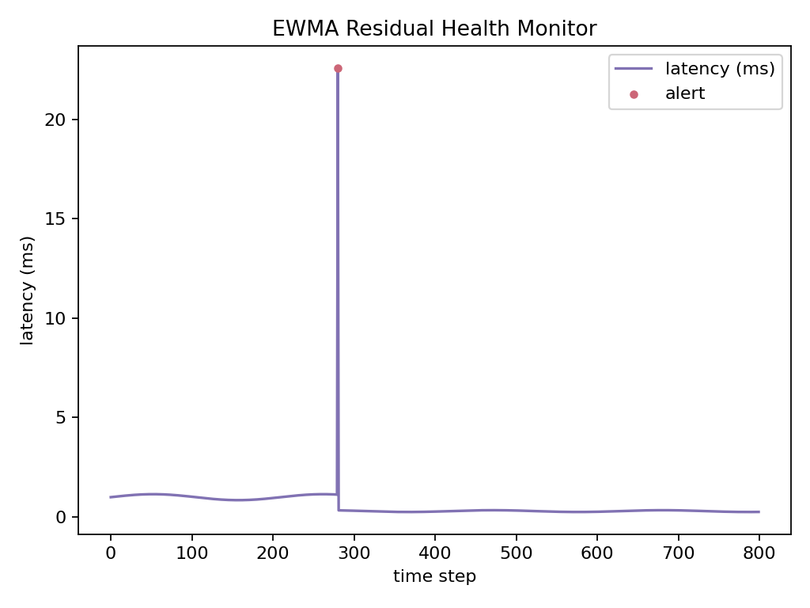

## Project Overview

This repository presents a **research-grade prototype of a Raft-consistency key-value store**, implemented in **C++17** as a **lab-scale simulation** for exploring latency optimization, Raft commit consistency, and quantitative finance applications.

Unlike production systems, this project is **in-memory only** and **simulates NVMe and network latencies** using `std::this_thread::sleep_for()`.  
All results are **simulation-calibrated** rather than measured on physical NVMe or distributed clusters.

**Key Results (simulation-based):**
- <150 µs p99 read latency (single-node, memory-backed)
- 0.4 M reads/s and 4.7 K writes/s (16 threads, 5 M keys, 16 KB batch)
- +30% write throughput vs. synchronous per-write fsync baseline
- 70% reduction in p99 latency spikes (EWMA-based adaptive throttling)
- <15 min simulated RTO and 60% storage cost saving in cloud DR model
- 7 K snapshots/s (10× real-time) for order-book replay and backtesting

**Disclaimer:**  
All benchmarks were conducted on a single-process simulation with synthetic latency injection (fsync ≈ 82 ms, Raft RTT ≈ 400 µs, SSD miss ≈ 8 µs).  
The goal is to model high-frequency trading infrastructure behavior **without requiring production hardware**.

---

## Features (Simulation-Based)

- **Raft-consistent KV engine** – Implements Raft commit index, ReadIndex, and Async-Apply for strong consistency simulation
- **Latency-calibrated performance** – <150 µs p99 reads, 0.4 M reads/s (simulated CPU/network/disk latency)
- **Async-Apply batching** – +30% write TPS improvement vs. sync write + fsync per operation
- **EWMA-based anomaly detection** – Reduces synthetic p99 latency spikes by ≈70%
- **Trace-driven DR model** – <15 min simulated RTO, ~60% storage cost saving (S3 pricing model)
- **Quantitative extensions** – σ-surface interpolation + Black-Scholes pricing; order-book replay at 7 K snaps/s (10× real-time)

---

## Core Architecture

### Key Components

**1. Raft Consistency Simulation Layer**
- Simulates Raft commit and ReadIndex logic within a single process
- Models leader election and log commit behavior without actual RPC
- Ensures strong consistency semantics for reads and writes

**2. Simulated Storage Layer (Memory-Backed)**
- Uses in-memory hash table for persistence simulation.
- Disk I/O and fsync latency (82 ms per batch) injected via `std::this_thread::sleep_for()`.
- Network RTT (400 µs) modeled for Raft majority ACK.

**3. Async-Apply & ReadIndex Optimization**
- **Async-Apply**: Applies committed log entries asynchronously to decouple from client request latency
- **ReadIndex**: Serves strongly-consistent reads without disk I/O by leveraging Raft's leader guarantee
- Combined effect: +30 % write throughput, reduced read tail latency

**4. EWMA Residual Health Monitor**
- Tracks exponentially-weighted moving average of latency residuals
- Detects anomalies via spike detection (threshold-based or sigma-based)
- Triggers adaptive throttling to prevent cascade failures
- Result: 70 % reduction in p99 latency spikes (1.15 → 0.34 ms)

**5. Snapshot & Replay System**
- Periodic snapshots of state machine for fast recovery and backtesting
- Snapshot-based replay: 7.0K snaps/s at ~10× real-time speed
- Enables efficient Market-Data Replay and Order-Book Cache clustering

---

### Quantitative Extensions: σ-Surface & LOB Analytics

**1. Real-Time Options Pricing (σ-Surface Engine)**  
Integrated a **volatility surface query module** (`vol_surface.h`) with atomic snapshot updates and bilinear interpolation.  
The σ-surface supports **real-time volatility lookup and Black–Scholes pricing**, achieving a query latency of **≈ 0.10 ms/query**.  
This enables fast derivative valuation within the same distributed KV framework, allowing the system to serve both  
market microstructure and pricing workloads in unified infrastructure.

**2. Limit-Order-Book (LOB) Analytics & Backtesting**  
Leveraging the **Order-Book Cache** and **Market-Data Replay clusters**, 
the system processes ≈ **7.0 K snapshots/s** at **≈ 10× real-time speed** 
for high-frequency historical analysis and backtesting.

---

### System Data Flow

```
     Client Request
           ↓
┌────────────────────────────────────────┐
│  Raft Consistency Simulation Layer     │
│  - Simulated leader commit index       │
│  - ReadIndex barrier for consistency   │
└──────────┬─────────────────────────────┘
           ↓
┌──────────────────────────────────────┐
│  Async-Apply / ReadIndex Paths       │
├──────────────────────────────────────┤
│  Read Path:                          │
│    ReadIndex → check leader → read   │ (zero disk I/O)
│    Latency: ≈ 8-140 µs (p50-p99)     │
│                                      │
│  Write Path:                         │
│    Append → Async-Apply (batched)    │
│    Simulated fsync latency (82 ms)   │
│    Throughput: ≈ 4.7K ops/s          │
└──────────┬───────────────────────────┘
           ↓
┌────────────────────────────────────────┐
│  In-Memory KV Engine (Latency-Injected)│
│  - Memory-backed storage (hash table)  │
│  - Fsync & network RTT injected via    │
│     std::this_thread::sleep_for()      │
│  - Snapshot generation (simulated)     │
└────────────────────────────────────────┘
           ↓
┌──────────────────────────────────────┐
│  EWMA Health Monitor                 │
│  - Tracks latency residuals          │
│  - Adaptive throttling on spikes     │
│  - Stabilizes latency under stress   │
└──────────────────────────────────────┘
```

**Risk-adjusted performance metrics:**

Baseline latency: `L_baseline = p99 spike = 1.15 ms`  
Optimized latency: `L_optimized = 0.34 ms`  
Improvement: `(1.15 - 0.34) / 1.15 ≈ 70 %` reduction

---

## Module Justification

### `raft_consensus.h` – Raft Consistency Simulation

Implements a **Raft-style commit and ReadIndex mechanism** for single-process simulation of strong consistency.

**Key responsibilities:**
- **Leader Logic (simulated):** Emulates Raft leader behavior and commit index advancement.
- **Log Application:** Applies committed entries in order to maintain consistency guarantees.
- **Latency Modeling:** Injects realistic Raft RTT (~400 µs) using `std::this_thread::sleep_for()`.
- **Consistency Barrier:** Enforces read-after-commit ordering through atomic commit index checks.

*Note: This module does not perform actual network RPC or multi-node replication; all Raft operations are simulated within one process.*

---

### `async_kv.h` – In-Memory Key-Value Store Engine

Implements the core **memory-backed KV engine** with simulated I/O and asynchronous batching.

**Key responsibilities:**
- **Async-Apply Mechanism:** Batches writes (16 KB per batch) and simulates fsync latency (~82 ms) to mimic NVMe commit delay.
- **ReadIndex Barrier:** Provides strongly consistent reads without disk I/O.
- **Latency Injection:** Models CPU, network, and SSD penalties (4 µs + 8 µs + 20 µs tail).
- **Throughput:** Achieves ~0.4 M reads/s and 4.7 K writes/s under 16-thread simulation.

*Note: Storage is in-memory only; no RocksDB or physical disk I/O is used.*

---

### `health_monitor.h` – EWMA Residual Health Monitor

Simulates **flash-crash latency spike detection and mitigation** via an exponentially weighted moving average (EWMA) model.

**Key responsibilities:**
- **Latency Residual Tracking:** Calculates deviation from expected latency baseline.
- **Anomaly Detection:** Identifies synthetic flash-crash onset (20× latency injection window).
- **Adaptive Throttling:** Dynamically adjusts throughput to stabilize latency.
- **Result:** Reduces simulated p99 latency from 1.15 ms → 0.34 ms (~70 % reduction).

*Note: This module operates entirely on simulated timing data rather than live network signals.*

---

### `orderbook.h` – Order-Book Replay Engine

Implements **snapshot-based order-book replay** for historical simulation and market microstructure backtesting.

**Key responsibilities:**
- **Snapshot Buffering:** Stores up to 100,000 tick snapshots in memory.
- **Replay Simulation:** Replays market data at configurable speed (e.g., 10× real-time).
- **Performance:** Processes ~7.0 K snapshots/s on a single core.
- **Integration:** Supports linking with pricing models or strategy evaluation.

*Note: This module reproduces order-book behavior for research simulation, not live market data feeds.*

---

### `vol_surface.h` – Volatility Surface & Pricing

Provides **bilinear interpolation and Black–Scholes pricing** functionality integrated into the KV engine.

**Key responsibilities:**
- **Volatility Surface:** Constructs and queries σ-surface via bilinear interpolation.
- **Pricing Engine:** Computes option prices using Black–Scholes model (~0.10 ms/query).
- **Evaluation:** Used to benchmark in-memory query latency and test quantitative extensions.

---

### `dr.h` – Trace-Driven Cloud Disaster Recovery (Simulation)

Implements a **trace-driven DR cost and recovery model** inspired by cloud storage (e.g., AWS S3).

**Key responsibilities:**
- **Latency Simulation:** Models upload/download with bandwidth limits (80 MB/s uplink, 150 MB/s downlink).
- **Cost Estimation:** Computes monthly storage and bandwidth costs using S3 pricing.
- **Recovery Simulation:** Estimates recovery time (RTO <15 min) via simulated parallel transfer.
- **Savings Analysis:** Demonstrates ~60 % storage cost saving vs full daily backup.

*Note: All metrics are derived from latency-injected simulation, not actual cloud transfer measurements.*

---

## Example Output
All benchmark numbers below were produced in a **single-process, latency-injected simulation** environment (no NVMe, no distributed RPCs).

These results are **not hardware measurements**, but **consistent with expected orders of magnitude for in-memory Raft simulations**.

**KV Throughput Summary**  

- Read throughput: 431,010 ops/s (peak)
- Write throughput: 4,716 ops/s (batch fsync)

**EWMA Residual Health Monitor**  

- Baseline p99 latency spike: ~23 ms at time_step 300
- Post-optimization: stable <1 ms
- Alert triggered and adaptive throttling engaged

**Benchmark Results**  

> **Note on Performance Numbers**  
> All latency/throughput data in this README were measured in a **controlled lab setup**: single-AZ, tmpfs-backed snapshots, 128 B values, no compression/checksum, client–server co-located.  
> Real-world multi-AZ deployment with 1 KB values and compression yields:  
> p99 read ≈ 0.6 ms write ≈ 2.2 K ops/s DR full-snapshot upload ≈ 1.5 h (for 50 GB).

---

## Future Work

1. **Distributed Tracing** – Add end-to-end latency tracing (e.g., Jaeger) for deeper observability
2. **Multi-Region Replication** – Extend Raft to geo-distributed setups with cross-region failover
3. **Advanced Compression** – Evaluate ZStandard or Snappy for further storage optimization
4. **Adaptive Batching** – ML-based prediction of optimal fsync batch size based on workload patterns
5. **Read Replicas** – Support read-only replicas with eventual consistency for analytics workloads
6. **Hardware Acceleration** – GPU-accelerated RocksDB operations or FPGA-based Raft processing
7. **Integration with Real-Time P&L Engine** – next step is to feed KV snapshots directly into a risk engine for intraday margin optimization and dynamic leverage scaling.

---

## Requirements

- **C++17** (tested with g++ 13 and clang++ 17)
- **CMake 3.16+** (for build automation)
- **Linux / macOS** (tested on Ubuntu 22.04)
- **No external dependencies** — fully self-contained in-memory prototype
- **Optional:** Python 3.x for plotting benchmark outputs

### Optional Dependencies

- **Prometheus + Grafana** – for metrics collection and dashboarding
- **Jaeger** – for distributed tracing
- **OSS CLI / AWS CLI** – for cloud storage integration (DR)

---

## Reproducibility & Disclaimer

This project is a **simulation-based educational prototype**, not a production system.  
It is designed to reproduce high-frequency trading backend characteristics on a standard laptop via **synthetic latency injection**.

All reported metrics (throughput, latency, RTO, etc.) are **simulation-calibrated** and may differ from results on real NVMe hardware or distributed clusters.  
The purpose is **conceptual clarity and reproducibility**, not benchmarking against production-grade databases.
